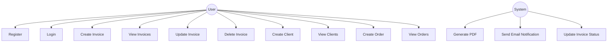
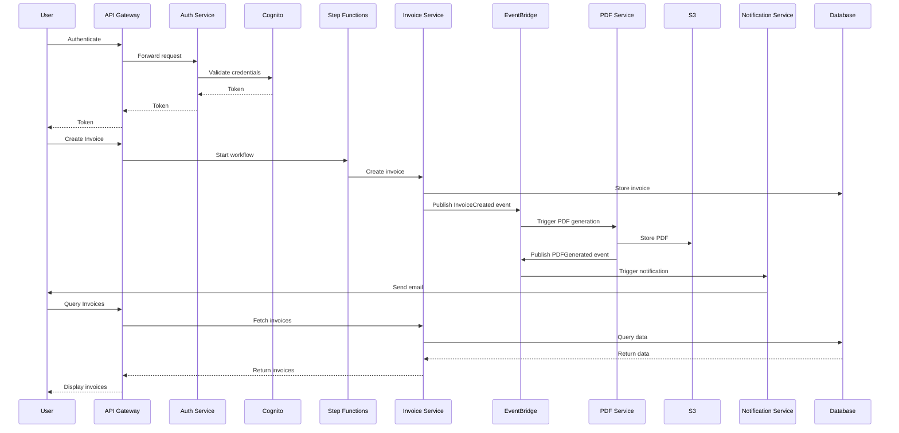

# doccentr
## Table of Contents
1. [Introduction](#1-introduction)
2. [System Architecture](#2-system-architecture)
3. [Use Case Diagram](#3-use-case-diagram)
4. [Microservices](#4-microservices)
5. [Event-Driven Communication](#5-event-driven-communication)
6. [Step Functions Workflow](#6-step-functions-workflow)
7. [Data Flow](#7-data-flow)
8. [Database Schemas](#8-database-schemas)
9. [System Workflow](#9-system-workflow)
10. [Security Considerations](#10-security-considerations)
11. [Advantages of the Architecture](#11-advantages-of-the-architecture)
12. [Scaling Options](#12-scaling-options)
13. [Authentication and Authorization](#13-authentication-and-authorization)
14. [Implementation Guide](#14-implementation-guide)
15. [Testing](#15-testing)
16. [Monitoring and Logging](#16-monitoring-and-logging)
17. [API Specification](#17-api-specification)   
18. [Conclusion](#18-conclusion)

## 1. Introduction

The Invoice Management System is designed as an event-driven microservices architecture with AWS Step Functions for workflow orchestration. It handles the creation, management, and processing of invoices, providing functionalities for user authentication, invoice generation, client management, order tracking, and PDF generation.

## 2. System Architecture

The system leverages the following AWS services:

- Amazon ECS (Elastic Container Service) for running microservices
- Amazon RDS (Relational Database Service) for individual MySQL databases
- Amazon Cognito for user authentication
- Amazon API Gateway for routing and API management
- Amazon EventBridge for event-driven communication between services
- AWS Step Functions for orchestrating complex workflows
- Amazon S3 for storing generated PDFs
- AWS KMS (Key Management Service) for managing encryption keys
- AWS Systems Manager Parameter Store for storing configuration and secrets

Here's the updated high-level architecture diagram:


## 3. Use Case Diagram

Here's a use case diagram for the Invoice Management System:


## 4.  MicroServices

Here's a detailed breakdown of each service, its purpose, and main methods:

### Auth Service

**Purpose**: Handle user authentication and authorization.

**Methods**:
- `register(email, password)`: Register a new user.
- `login(email, password)`: Authenticate a user and return a JWT token.
- `verifyToken(token)`: Verify the validity of a JWT token.
- `resetPassword(email)`: Initiate the password reset process.

### Invoice Service

**Purpose**: Manage invoice creation, retrieval, and updates.

**Methods**:
- `createInvoice(clientId, items, dueDate)`: Create a new invoice.
- `getInvoice(invoiceId)`: Retrieve a specific invoice.
- `listInvoices(filters)`: Retrieve a list of invoices based on filters.
- `updateInvoiceStatus(invoiceId, status)`: Update the status of an invoice.
- `deleteInvoice(invoiceId)`: Delete an invoice (soft delete).

### Client Service

**Purpose**: Manage client information.

**Methods**:
- `createClient(name, email, address, phone)`: Create a new client.
- `getClient(clientId)`: Retrieve a specific client's information.
- `listClients(filters)`: Retrieve a list of clients based on filters.
- `updateClient(clientId, details)`: Update a client's information.
- `deleteClient(clientId)`: Delete a client (soft delete).

### Order Service

**Purpose**: Manage order information.

**Methods**:
- `createOrder(clientId, items)`: Create a new order.
- `getOrder(orderId)`: Retrieve a specific order.
- `listOrders(filters)`: Retrieve a list of orders based on filters.
- `updateOrderStatus(orderId, status)`: Update the status of an order.
- `deleteOrder(orderId)`: Delete an order (soft delete).

### PDF Service

**Purpose**: Generate PDF invoices.

**Methods**:
- `generatePDF(invoiceId)`: Generate a PDF for a given invoice.
- `getPDFUrl(invoiceId)`: Get the S3 URL for a generated PDF.

### Notification Service

**Purpose**: Send notifications to users and clients.

**Methods**:
- `sendInvoiceNotification(invoiceId, recipientEmail)`: Send an email notification about an invoice.
- `sendReminder(invoiceId)`: Send a reminder for an unpaid invoice.
- `sendStatusUpdate(invoiceId, status)`: Notify about an invoice status change.

## 5. Event-Driven Communication

Services communicate through events published to Amazon EventBridge. Key events include:

1. UserRegistered
2. UserLoggedIn
3. InvoiceCreated
4. InvoiceUpdated
5. PDFGenerated
6. EmailSent

## 6. Step Functions Workflow

The invoice creation process is orchestrated using AWS Step Functions

## 7. Data Flow

The data flow in the Invoice Management System follows these general patterns:

1. **User Authentication Flow**:
   - User → API Gateway → Auth Service → Cognito → Auth Service → API Gateway → User

2. **Invoice Creation Flow**:
   - User → API Gateway → Step Functions → Invoice Service → EventBridge → PDF Service → S3 → EventBridge → Notification Service → User

3. **Query Flow** (e.g., fetching invoices):
   - User → API Gateway → Invoice Service → Database → Invoice Service → API Gateway → User

Here's a diagram illustrating the main data flows:



## 8. Database Schemas

Each service has its own database to ensure data isolation. Here are the main database schemas:

### Auth Database
```sql
CREATE TABLE users (
    id INT AUTO_INCREMENT PRIMARY KEY,
    email VARCHAR(255) UNIQUE NOT NULL,
    password_hash VARCHAR(255) NOT NULL,
    created_at TIMESTAMP DEFAULT CURRENT_TIMESTAMP,
    updated_at TIMESTAMP DEFAULT CURRENT_TIMESTAMP ON UPDATE CURRENT_TIMESTAMP
);
```

### Invoice Database
```sql
CREATE TABLE invoices (
    id INT AUTO_INCREMENT PRIMARY KEY,
    invoice_number VARCHAR(50) UNIQUE NOT NULL,
    client_id INT NOT NULL,
    total_amount DECIMAL(10, 2) NOT NULL,
    status ENUM('draft', 'sent', 'paid', 'overdue') NOT NULL,
    issue_date DATE NOT NULL,
    due_date DATE NOT NULL,
    pdf_url VARCHAR(255),
    created_at TIMESTAMP DEFAULT CURRENT_TIMESTAMP,
    updated_at TIMESTAMP DEFAULT CURRENT_TIMESTAMP ON UPDATE CURRENT_TIMESTAMP
);

CREATE TABLE invoice_items (
    id INT AUTO_INCREMENT PRIMARY KEY,
    invoice_id INT NOT NULL,
    description VARCHAR(255) NOT NULL,
    quantity INT NOT NULL,
    unit_price DECIMAL(10, 2) NOT NULL,
    total_price DECIMAL(10, 2) NOT NULL,
    FOREIGN KEY (invoice_id) REFERENCES invoices(id) ON DELETE CASCADE
);
```

### Client Database
```sql
CREATE TABLE clients (
    id INT AUTO_INCREMENT PRIMARY KEY,
    name VARCHAR(255) NOT NULL,
    email VARCHAR(255) UNIQUE NOT NULL,
    address TEXT,
    phone VARCHAR(20),
    created_at TIMESTAMP DEFAULT CURRENT_TIMESTAMP,
    updated_at TIMESTAMP DEFAULT CURRENT_TIMESTAMP ON UPDATE CURRENT_TIMESTAMP
);
```

### Order Database
```sql
CREATE TABLE orders (
    id INT AUTO_INCREMENT PRIMARY KEY,
    order_number VARCHAR(50) UNIQUE NOT NULL,
    client_id INT NOT NULL,
    total_amount DECIMAL(10, 2) NOT NULL,
    status ENUM('pending', 'processing', 'completed', 'cancelled') NOT NULL,
    order_date DATE NOT NULL,
    created_at TIMESTAMP DEFAULT CURRENT_TIMESTAMP,
    updated_at TIMESTAMP DEFAULT CURRENT_TIMESTAMP ON UPDATE CURRENT_TIMESTAMP
);

CREATE TABLE order_items (
    id INT AUTO_INCREMENT PRIMARY KEY,
    order_id INT NOT NULL,
    product_name VARCHAR(255) NOT NULL,
    quantity INT NOT NULL,
    unit_price DECIMAL(10, 2) NOT NULL,
    total_price DECIMAL(10, 2) NOT NULL,
    FOREIGN KEY (order_id) REFERENCES orders(id) ON DELETE CASCADE
);
```

## 9. System Workflow

The overall system workflow for creating an invoice is as follows:

1. **User Authentication**:
   - User logs in through the frontend application.
   - Auth Service validates credentials with Cognito and returns a JWT token.

2. **Invoice Creation**:
   - User initiates invoice creation through the frontend.
   - API Gateway receives the request and triggers the Step Functions workflow.
   - Step Functions orchestrates the following steps:
     a. Invoice Service creates the invoice record in the database.
     b. PDF Service generates a PDF for the invoice and stores it in S3.
     c. Notification Service sends an email to the client with the invoice details.

3. **Event Publishing**:
   - Each service publishes events to EventBridge upon completing significant actions.
   - Other services can subscribe to these events for further processing or updates.

4. **Query and Retrieval**:
   - Users can query for invoices, clients, or orders through the API.
   - Respective services retrieve the data from their databases and return it through API Gateway.

5. **Status Updates**:
   - Invoice statuses can be updated manually by users or automatically by the system (e.g., marking as overdue).
   - Status updates trigger events for potential further actions (e.g., sending reminders).

## 10. Security Considerations

1. **Authentication**: Amazon Cognito handles user authentication securely.
2. **Authorization**: API Gateway uses Cognito User Pool Authorizer to enforce access control.
3. **Encryption**: Use AWS KMS for encrypting sensitive data at rest and in transit.
4. **Secrets Management**: AWS Secrets Manager stores database credentials and other secrets.
5. **Network Security**: VPC security groups and network ACLs control traffic between services.
6. **HTTPS**: All API communications use HTTPS.
7. **Least Privilege**: IAM roles for ECS tasks follow the principle of least privilege.
8. **Event Security**: EventBridge uses resource-based policies to control which services can publish events.

## 11. Advantages of the Architecture

1. **Loose Coupling**: Services communicate via events, reducing direct dependencies.
2. **Scalability**: Each service can scale independently based on demand.
3. **Flexibility**: Easy to add new services or modify existing ones without impacting the entire system.
4. **Resilience**: Temporary service unavailability doesn't break the system; events can be processed when the service recovers.
5. **Workflow Management**: Step Functions provides robust handling of complex, multi-step processes.
6. **Easier Maintenance**: Smaller, focused services are easier to understand and maintain.
7. **Improved Fault Isolation**: Issues can be isolated to specific services.
8. **Event-Driven**: Enables real-time processing and reactive system behavior.

## 12. Scaling Options

1. **ECS Auto Scaling**: Use ECS Service Auto Scaling to adjust the number of tasks based on CPU/memory utilization or custom metrics.
2. **Database Scaling**: Utilize RDS read replicas for read-heavy workloads.
3. **API Gateway Throttling**: Implement request throttling at the API Gateway level to protect backend services.
4. **EventBridge Throughput**: Monitor and adjust EventBridge throughput as needed.
5. **Step Functions Concurrent Executions**: Adjust the concurrent execution limit for Step Functions state machines as needed.

## 13. Authentication and Authorization

1. **User Registration and Login**: Handled by Cognito User Pools.
2. **Token-based Authentication**: Cognito issues JWT tokens for authenticated users.
3. **API Authorization**: API Gateway validates JWT tokens and enforces access control.
4. **Fine-grained Access Control**: Implement custom authorizers in API Gateway for more granular control.

## 14. Implementation Guide

1. Set up AWS account and install AWS CDK.
2. Clone the project repository.
3. Update the `cdk.json` file with your AWS account details.
4. Implement each microservice following the provided sample code.
5. Build Docker images for each service and push to ECR.
6. Deploy the CDK stack.
7. Set up EventBridge rules for routing events between services.
8. Implement event handlers in each service to process incoming events.
9. Configure Step Functions for orchestrating workflows that span multiple services.
10. Set up monitoring and alerting using CloudWatch.

## 15. Testing

Implement unit tests, integration tests, and end-to-end tests for each service. Use AWS SDK mocks for testing AWS service interactions. Example of a unit test for the Invoice Service:

```php
<?php
use PHPUnit\Framework\TestCase;

class InvoiceServiceTest extends TestCase
{
    private $invoiceService;
    private $dbMock;
    private $eventBridgeMock;

    protected function setUp(): void
    {
        $this->dbMock = $this->createMock(PDO::class);
        $this->eventBridgeMock = $this->createMock(Aws\EventBridge\EventBridgeClient::class);
        $this->invoiceService = new InvoiceService($this->dbMock, $this->eventBridgeMock);
    }

    public function testCreateInvoice()
    {
        // Test implementation
    }

    // More test methods...
}
```

## 16. Monitoring and Logging

1. **CloudWatch Logs**: Each ECS service sends logs to CloudWatch Log Groups.
2. **CloudWatch Metrics**: Monitor key metrics like CPU utilization, memory usage, and API Gateway request counts.
3. **CloudWatch Alarms**: Set up alarms for critical thresholds (e.g., high error rates, low event processing rates).
4. **X-Ray Tracing**: Implement distributed tracing to monitor and analyze service interactions.
5. **EventBridge Insights**: Use EventBridge Insights to monitor event patterns and detect anomalies.
6. **Step Functions Monitoring**: Use AWS Step Functions console to monitor workflow executions.

## 17. API Specification
```yaml
openapi: 3.0.0
info:
  title: Invoice Management System API
  description: API for managing invoices, clients, and orders in the Invoice Management System
  version: 1.0.0
servers:
  - url: https://api.doccentr.com/v1
paths:
  /auth/register:
    post:
      summary: Register a new user
      tags:
        - Authentication
      requestBody:
        required: true
        content:
          application/json:
            schema:
              type: object
              required:
                - email
                - password
              properties:
                email:
                  type: string
                  format: email
                password:
                  type: string
                  format: password
      responses:
        '200':
          description: User registered successfully
        '400':
          description: Invalid input

  /auth/login:
    post:
      summary: Authenticate a user
      tags:
        - Authentication
      requestBody:
        required: true
        content:
          application/json:
            schema:
              type: object
              required:
                - email
                - password
              properties:
                email:
                  type: string
                  format: email
                password:
                  type: string
                  format: password
      responses:
        '200':
          description: Authentication successful
          content:
            application/json:
              schema:
                type: object
                properties:
                  token:
                    type: string
        '401':
          description: Authentication failed

  /invoices:
    get:
      summary: List all invoices
      tags:
        - Invoices
      security:
        - BearerAuth: []
      parameters:
        - in: query
          name: status
          schema:
            type: string
            enum: [draft, sent, paid, overdue]
        - in: query
          name: client_id
          schema:
            type: integer
      responses:
        '200':
          description: Successful response
          content:
            application/json:    
              schema:
                type: array
                items:
                  $ref: '#/components/schemas/Invoice'
    post:
      summary: Create a new invoice
      tags:
        - Invoices
      security:
        - BearerAuth: []
      requestBody:
        required: true
        content:
          application/json:
            schema:
              $ref: '#/components/schemas/InvoiceInput'
      responses:
        '201':
          description: Invoice created
          content:
            application/json:
              schema:
                $ref: '#/components/schemas/Invoice'

  /invoices/{invoiceId}:
    get:
      summary: Get a specific invoice
      tags:
        - Invoices
      security:
        - BearerAuth: []
      parameters:
        - in: path
          name: invoiceId
          required: true
          schema:
            type: integer
      responses:
        '200':
          description: Successful response
          content:
            application/json:
              schema:
                $ref: '#/components/schemas/Invoice'
        '404':
          description: Invoice not found
    put:
      summary: Update an invoice
      tags:
        - Invoices
      security:
        - BearerAuth: []
      parameters:
        - in: path
          name: invoiceId
          required: true
          schema:
            type: integer
      requestBody:
        required: true
        content:
          application/json:
            schema:
              $ref: '#/components/schemas/InvoiceUpdate'
      responses:
        '200':
          description: Invoice updated
        '404':
          description: Invoice not found

  /clients:
    get:
      summary: List all clients
      tags:
        - Clients
      security:
        - BearerAuth: []
      responses:
        '200':
          description: Successful response
          content:
            application/json:
              schema:
                type: array
                items:
                  $ref: '#/components/schemas/Client'
    post:
      summary: Create a new client
      tags:
        - Clients
      security:
        - BearerAuth: []
      requestBody:
        required: true
        content:
          application/json:
            schema:
              $ref: '#/components/schemas/ClientInput'
      responses:
        '201':
          description: Client created
          content:
            application/json:
              schema:
                $ref: '#/components/schemas/Client'

  /clients/{clientId}:
    get:
      summary: Get a specific client
      tags:
        - Clients
      security:
        - BearerAuth: []
      parameters:
        - in: path
          name: clientId
          required: true
          schema:
            type: integer
      responses:
        '200':
          description: Successful response
          content:
            application/json:
              schema:
                $ref: '#/components/schemas/Client'
        '404':
          description: Client not found

  /orders:
    get:
      summary: List all orders
      tags:
        - Orders
      security:
        - BearerAuth: []
      responses:
        '200':
          description: Successful response
          content:
            application/json:
              schema:
                type: array
                items:
                  $ref: '#/components/schemas/Order'
    post:
      summary: Create a new order
      tags:
        - Orders
      security:
        - BearerAuth: []
      requestBody:
        required: true
        content:
          application/json:
            schema:
              $ref: '#/components/schemas/OrderInput'
      responses:
        '201':
          description: Order created
          content:
            application/json:
              schema:
                $ref: '#/components/schemas/Order'

  /orders/{orderId}:
    get:
      summary: Get a specific order
      tags:
        - Orders
      security:
        - BearerAuth: []
      parameters:
        - in: path
          name: orderId
          required: true
          schema:
            type: integer
      responses:
        '200':
          description: Successful response
          content:
            application/json:
              schema:
                $ref: '#/components/schemas/Order'
        '404':
          description: Order not found

components:
  schemas:
    Invoice:
      type: object
      properties:
        id:
          type: integer
        invoice_number:
          type: string
        client_id:
          type: integer
        total_amount:
          type: number
        status:
          type: string
          enum: [draft, sent, paid, overdue]
        issue_date:
          type: string
          format: date
        due_date:
          type: string
          format: date
        items:
          type: array
          items:
            $ref: '#/components/schemas/InvoiceItem'

    InvoiceInput:
      type: object
      required:
        - client_id
        - items
      properties:
        client_id:
          type: integer
        issue_date:
          type: string
          format: date
        due_date:
          type: string
          format: date
        items:
          type: array
          items:
            $ref: '#/components/schemas/InvoiceItemInput'

    InvoiceUpdate:
      type: object
      properties:
        status:
          type: string
          enum: [draft, sent, paid, overdue]
        due_date:
          type: string
          format: date

    InvoiceItem:
      type: object
      properties:
        id:
          type: integer
        description:
          type: string
        quantity:
          type: integer
        unit_price:
          type: number
        total_price:
          type: number

    InvoiceItemInput:
      type: object
      required:
        - description
        - quantity
        - unit_price
      properties:
        description:
          type: string
        quantity:
          type: integer
        unit_price:
          type: number

    Client:
      type: object
      properties:
        id:
          type: integer
        name:
          type: string
        email:
          type: string
        address:
          type: string
        phone:
          type: string

    ClientInput:
      type: object
      required:
        - name
        - email
      properties:
        name:
          type: string
        email:
          type: string
        address:
          type: string
        phone:
          type: string

    Order:
      type: object
      properties:
        id:
          type: integer
        order_number:
          type: string
        client_id:
          type: integer
        total_amount:
          type: number
        status:
          type: string
          enum: [pending, processing, completed, cancelled]
        order_date:
          type: string
          format: date
        items:
          type: array
          items:
            $ref: '#/components/schemas/OrderItem'

    OrderInput:
      type: object
      required:
        - client_id
        - items
      properties:
        client_id:
          type: integer
        items:
          type: array
          items:
            $ref: '#/components/schemas/OrderItemInput'

    OrderItem:
      type: object
      properties:
        id:
          type: integer
        product_name:
          type: string
        quantity:
          type: integer
        unit_price:
          type: number
        total_price:
          type: number

    OrderItemInput:
      type: object
      required:
        - product_name
        - quantity
        - unit_price
      properties:
        product_name:
          type: string
        quantity:
          type: integer
        unit_price:
          type: number

  securitySchemes:
    BearerAuth:
      type: http
      scheme: bearer
      bearerFormat: JWT
```

## 18. Conclusion

Each of the services is designed to be independent, focusing on its specific domain. They communicate with each other primarily through events published to EventBridge, maintaining loose coupling and allowing for easy scalability and modification of the system. The Step Functions workflow coordinates the complex process of invoice creation, ensuring that all steps are completed in the correct order and handling any potential failures or retries as needed.
This architecture allows for a flexible, scalable, and maintainable system that can easily adapt to changing business requirements while providing robust invoice management capabilities.

