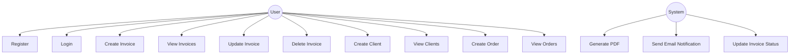
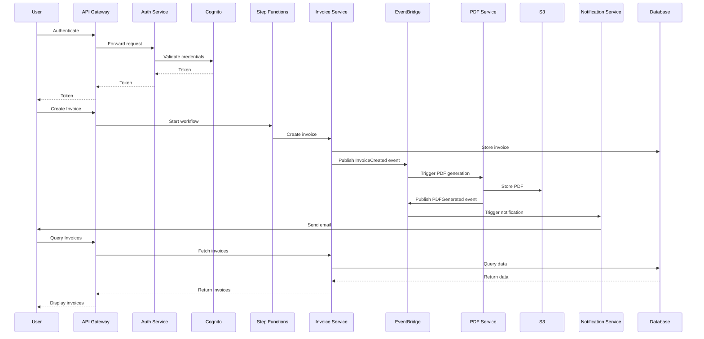

# doccentr
## Table of Contents
1. [Introduction](#1-introduction)
2. [System Architecture](#2-system-architecture)
3. [Use Case Diagram](#3-use-case-diagram)
4. [Microservices](#4-microservices)
5. [Event-Driven Communication](#5-event-driven-communication)
6. [Step Functions Workflow](#6-step-functions-workflow)
7. [Infrastructure as Code](#7-infrastructure-as-code)
8. [Security Considerations](#8-security-considerations)
9. [Advantages of the Architecture](#9-advantages-of-the-architecture)
10. [Scaling Options](#10-scaling-options)
11. [Authentication and Authorization](#11-authentication-and-authorization)
12. [Implementation Guide](#12-implementation-guide)
13. [Testing](#13-testing)
14. [Monitoring and Logging](#14-monitoring-and-logging)
16. [Data Flow](#16-data-flow)
17. [Database Schemas](#17-database-schemas)
18. [System Workflow](#18-system-workflow)
19. [Service Breakdown](#19-service-breakdown)
20. [Conclusion](#15-conclusion)

## 1. Introduction

The Invoice Management System is designed as an event-driven microservices architecture with AWS Step Functions for workflow orchestration. It handles the creation, management, and processing of invoices, providing functionalities for user authentication, invoice generation, client management, order tracking, and PDF generation.

## 2. System Architecture

The system leverages the following AWS services:

- Amazon ECS (Elastic Container Service) for running microservices
- Amazon RDS (Relational Database Service) for individual MySQL databases
- Amazon Cognito for user authentication
- Amazon API Gateway for routing and API management
- Amazon EventBridge for event-driven communication between services
- AWS Step Functions for orchestrating complex workflows
- Amazon S3 for storing generated PDFs
- AWS KMS (Key Management Service) for managing encryption keys
- AWS Systems Manager Parameter Store for storing configuration and secrets

Here's the updated high-level architecture diagram:


## 3. Use Case Diagram

Here's a use case diagram for the Invoice Management System:


## 4.  MicroServices

Here's a detailed breakdown of each service, its purpose, and main methods:

### Auth Service

**Purpose**: Handle user authentication and authorization.

**Methods**:
- `register(email, password)`: Register a new user.
- `login(email, password)`: Authenticate a user and return a JWT token.
- `verifyToken(token)`: Verify the validity of a JWT token.
- `resetPassword(email)`: Initiate the password reset process.

### Invoice Service

**Purpose**: Manage invoice creation, retrieval, and updates.

**Methods**:
- `createInvoice(clientId, items, dueDate)`: Create a new invoice.
- `getInvoice(invoiceId)`: Retrieve a specific invoice.
- `listInvoices(filters)`: Retrieve a list of invoices based on filters.
- `updateInvoiceStatus(invoiceId, status)`: Update the status of an invoice.
- `deleteInvoice(invoiceId)`: Delete an invoice (soft delete).

### Client Service

**Purpose**: Manage client information.

**Methods**:
- `createClient(name, email, address, phone)`: Create a new client.
- `getClient(clientId)`: Retrieve a specific client's information.
- `listClients(filters)`: Retrieve a list of clients based on filters.
- `updateClient(clientId, details)`: Update a client's information.
- `deleteClient(clientId)`: Delete a client (soft delete).

### Order Service

**Purpose**: Manage order information.

**Methods**:
- `createOrder(clientId, items)`: Create a new order.
- `getOrder(orderId)`: Retrieve a specific order.
- `listOrders(filters)`: Retrieve a list of orders based on filters.
- `updateOrderStatus(orderId, status)`: Update the status of an order.
- `deleteOrder(orderId)`: Delete an order (soft delete).

### PDF Service

**Purpose**: Generate PDF invoices.

**Methods**:
- `generatePDF(invoiceId)`: Generate a PDF for a given invoice.
- `getPDFUrl(invoiceId)`: Get the S3 URL for a generated PDF.

### Notification Service

**Purpose**: Send notifications to users and clients.

**Methods**:
- `sendInvoiceNotification(invoiceId, recipientEmail)`: Send an email notification about an invoice.
- `sendReminder(invoiceId)`: Send a reminder for an unpaid invoice.
- `sendStatusUpdate(invoiceId, status)`: Notify about an invoice status change.

## 5. Event-Driven Communication

Services communicate through events published to Amazon EventBridge. Key events include:

1. UserRegistered
2. UserLoggedIn
3. InvoiceCreated
4. InvoiceUpdated
5. PDFGenerated
6. EmailSent

## 6. Step Functions Workflow

The invoice creation process is orchestrated using AWS Step Functions

## 16. Data Flow

The data flow in the Invoice Management System follows these general patterns:

1. **User Authentication Flow**:
   - User → API Gateway → Auth Service → Cognito → Auth Service → API Gateway → User

2. **Invoice Creation Flow**:
   - User → API Gateway → Step Functions → Invoice Service → EventBridge → PDF Service → S3 → EventBridge → Notification Service → User

3. **Query Flow** (e.g., fetching invoices):
   - User → API Gateway → Invoice Service → Database → Invoice Service → API Gateway → User

Here's a diagram illustrating the main data flows:



## 17. Database Schemas

Each service has its own database to ensure data isolation. Here are the main database schemas:

### Auth Database
```sql
CREATE TABLE users (
    id INT AUTO_INCREMENT PRIMARY KEY,
    email VARCHAR(255) UNIQUE NOT NULL,
    password_hash VARCHAR(255) NOT NULL,
    created_at TIMESTAMP DEFAULT CURRENT_TIMESTAMP,
    updated_at TIMESTAMP DEFAULT CURRENT_TIMESTAMP ON UPDATE CURRENT_TIMESTAMP
);
```

### Invoice Database
```sql
CREATE TABLE invoices (
    id INT AUTO_INCREMENT PRIMARY KEY,
    invoice_number VARCHAR(50) UNIQUE NOT NULL,
    client_id INT NOT NULL,
    total_amount DECIMAL(10, 2) NOT NULL,
    status ENUM('draft', 'sent', 'paid', 'overdue') NOT NULL,
    issue_date DATE NOT NULL,
    due_date DATE NOT NULL,
    pdf_url VARCHAR(255),
    created_at TIMESTAMP DEFAULT CURRENT_TIMESTAMP,
    updated_at TIMESTAMP DEFAULT CURRENT_TIMESTAMP ON UPDATE CURRENT_TIMESTAMP
);

CREATE TABLE invoice_items (
    id INT AUTO_INCREMENT PRIMARY KEY,
    invoice_id INT NOT NULL,
    description VARCHAR(255) NOT NULL,
    quantity INT NOT NULL,
    unit_price DECIMAL(10, 2) NOT NULL,
    total_price DECIMAL(10, 2) NOT NULL,
    FOREIGN KEY (invoice_id) REFERENCES invoices(id) ON DELETE CASCADE
);
```

### Client Database
```sql
CREATE TABLE clients (
    id INT AUTO_INCREMENT PRIMARY KEY,
    name VARCHAR(255) NOT NULL,
    email VARCHAR(255) UNIQUE NOT NULL,
    address TEXT,
    phone VARCHAR(20),
    created_at TIMESTAMP DEFAULT CURRENT_TIMESTAMP,
    updated_at TIMESTAMP DEFAULT CURRENT_TIMESTAMP ON UPDATE CURRENT_TIMESTAMP
);
```

### Order Database
```sql
CREATE TABLE orders (
    id INT AUTO_INCREMENT PRIMARY KEY,
    order_number VARCHAR(50) UNIQUE NOT NULL,
    client_id INT NOT NULL,
    total_amount DECIMAL(10, 2) NOT NULL,
    status ENUM('pending', 'processing', 'completed', 'cancelled') NOT NULL,
    order_date DATE NOT NULL,
    created_at TIMESTAMP DEFAULT CURRENT_TIMESTAMP,
    updated_at TIMESTAMP DEFAULT CURRENT_TIMESTAMP ON UPDATE CURRENT_TIMESTAMP
);

CREATE TABLE order_items (
    id INT AUTO_INCREMENT PRIMARY KEY,
    order_id INT NOT NULL,
    product_name VARCHAR(255) NOT NULL,
    quantity INT NOT NULL,
    unit_price DECIMAL(10, 2) NOT NULL,
    total_price DECIMAL(10, 2) NOT NULL,
    FOREIGN KEY (order_id) REFERENCES orders(id) ON DELETE CASCADE
);
```

## 18. System Workflow

The overall system workflow for creating an invoice is as follows:

1. **User Authentication**:
   - User logs in through the frontend application.
   - Auth Service validates credentials with Cognito and returns a JWT token.

2. **Invoice Creation**:
   - User initiates invoice creation through the frontend.
   - API Gateway receives the request and triggers the Step Functions workflow.
   - Step Functions orchestrates the following steps:
     a. Invoice Service creates the invoice record in the database.
     b. PDF Service generates a PDF for the invoice and stores it in S3.
     c. Notification Service sends an email to the client with the invoice details.

3. **Event Publishing**:
   - Each service publishes events to EventBridge upon completing significant actions.
   - Other services can subscribe to these events for further processing or updates.

4. **Query and Retrieval**:
   - Users can query for invoices, clients, or orders through the API.
   - Respective services retrieve the data from their databases and return it through API Gateway.

5. **Status Updates**:
   - Invoice statuses can be updated manually by users or automatically by the system (e.g., marking as overdue).
   - Status updates trigger events for potential further actions (e.g., sending reminders).


Each of these services is designed to be independent, focusing on its specific domain. They communicate with each other primarily through events published to EventBridge, maintaining loose coupling and allowing for easy scalability and modification of the system.

The Step Functions workflow coordinates the complex process of invoice creation, ensuring that all steps are completed in the correct order and handling any potential failures or retries as needed.

This architecture allows for a flexible, scalable, and maintainable system that can easily adapt to changing business requirements while providing robust invoice management capabilities.
