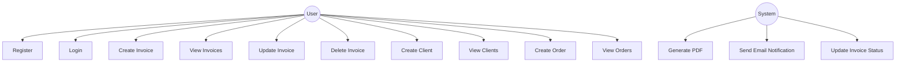

# doccentr
## Table of Contents
1. [Introduction](#1-introduction)
2. [System Architecture](#2-system-architecture)
3. [Use Case Diagram](#3-use-case-diagram)
4. [Microservices](#4-microservices)
5. [Event-Driven Communication](#5-event-driven-communication)
6. [Step Functions Workflow](#6-step-functions-workflow)
7. [Infrastructure as Code](#7-infrastructure-as-code)
8. [Security Considerations](#8-security-considerations)
9. [Advantages of the Architecture](#9-advantages-of-the-architecture)
10. [Scaling Options](#10-scaling-options)
11. [Authentication and Authorization](#11-authentication-and-authorization)
12. [Implementation Guide](#12-implementation-guide)
13. [Testing](#13-testing)
14. [Monitoring and Logging](#14-monitoring-and-logging)
16. [Data Flow](#16-data-flow)
17. [Database Schemas](#17-database-schemas)
18. [System Workflow](#18-system-workflow)
19. [Service Breakdown](#19-service-breakdown)
20. [Conclusion](#15-conclusion)

## 1. Introduction

The Invoice Management System is designed as an event-driven microservices architecture with AWS Step Functions for workflow orchestration. It handles the creation, management, and processing of invoices, providing functionalities for user authentication, invoice generation, client management, order tracking, and PDF generation.

## 2. System Architecture

The system leverages the following AWS services:

- Amazon ECS (Elastic Container Service) for running microservices
- Amazon RDS (Relational Database Service) for individual MySQL databases
- Amazon Cognito for user authentication
- Amazon API Gateway for routing and API management
- Amazon EventBridge for event-driven communication between services
- AWS Step Functions for orchestrating complex workflows
- Amazon S3 for storing generated PDFs
- AWS KMS (Key Management Service) for managing encryption keys
- AWS Systems Manager Parameter Store for storing configuration and secrets

Here's the updated high-level architecture diagram:

## 3. Use Case Diagram

Here's a use case diagram for the Invoice Management System:

